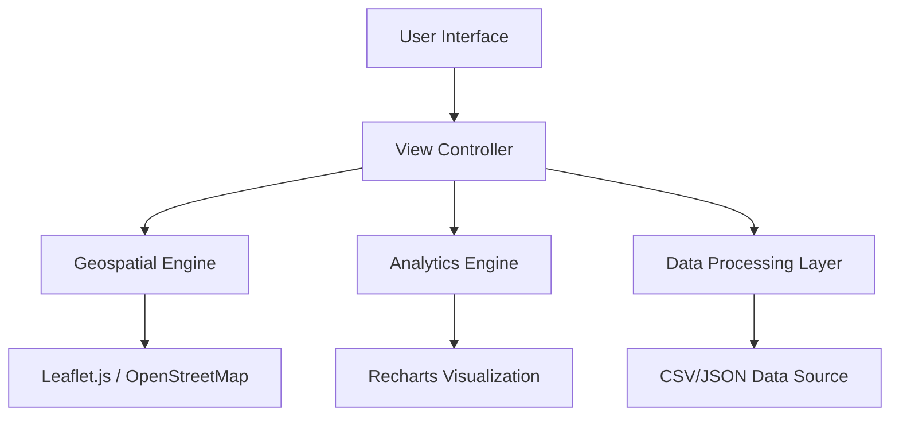

# System Design & Architecture: UrbanInsight

UrbanInsight is a high-performance, geospatial intelligence platform designed for urban monitoring and data-driven decision-making. The system follows a modern, client-side-heavy architecture optimized for real-time visualization and interactive data exploration.

## 1. High-Level Architecture

The application is built as a **Single Page Application (SPA)** using **React 18** and **Vite**. It prioritizes low-latency interactions and smooth visual transitions to maintain a "Mission Control" user experience.

## 2. Component Breakdown

### A. Geospatial Engine (Leaflet.js)
*   **Purpose**: Handles the rendering of maps, markers, and intensity overlays.
*   **Implementation**: Uses `react-leaflet` for declarative map management.
*   **Features**: Dynamic layer switching, custom tile providers (CartoDB Dark Matter), and coordinate-to-node mapping.

### B. Analytics & Visualization (Recharts)
*   **Purpose**: Translates raw geospatial data into actionable insights through charts and graphs.
*   **Implementation**: Responsive Recharts components integrated with the active data layer.
*   **Metrics**: Intensity distribution, category breakdowns, and regional comparisons.

### C. Data Processing Layer
*   **Purpose**: Normalizes and filters raw data points for visualization.
*   **Logic**: 
    *   **Normalization**: Calculates intensity percentages relative to the dataset peak.
    *   **Filtering**: Real-time filtering based on active categories or search queries.
    *   **Memoization**: Uses React's `useMemo` to prevent expensive recalculations during UI updates.

### D. UI/UX Framework (Tailwind + Framer Motion)
*   **Purpose**: Provides the "Mission Control" aesthetic and fluid interactions.
*   **Styling**: Utility-first CSS via Tailwind for high-density layouts and glassmorphism effects.
*   **Animation**: `framer-motion` for layout transitions, sidebars, and data-entry effects.

## 3. Data Flow

1.  **Ingestion**: The system accepts geospatial data points (Latitude, Longitude, Label, Value).
2.  **Transformation**: Data is processed to determine intensity gradients (e.g., 0-100% scale).
3.  **State Management**: The `activeLayerId` determines which dataset is currently active in the view.
4.  **Rendering**: 
    *   The **Map** renders markers with color-coded intensity.
    *   The **Analytics Sidebar** updates to show statistics relevant to the active layer.
    *   The **Status Rail** provides real-time system health and data counts.

## 4. Design Patterns

*   **Observer Pattern**: Used for map interaction (clicks) to identify the nearest data node.
*   **Strategy Pattern**: Different analytical strategies are applied based on the selected urban layer (Traffic vs. Energy vs. Safety).
*   **Composition**: Modular components (Sidebar, MapView, RegionalMatrix) are composed to build complex views.

## 5. Scalability & Future Roadmap

*   **Backend Integration**: Transition to a Node.js/Express backend for handling massive datasets (>100k points).
*   **Spatial Database**: Implementation of PostgreSQL with **PostGIS** for server-side spatial queries and clustering.
*   **Real-time Streaming**: Integration with WebSockets (Socket.io) for live IoT sensor feeds.
*   **AI Insights**: Integration with Gemini API for automated urban trend analysis and anomaly detection.
